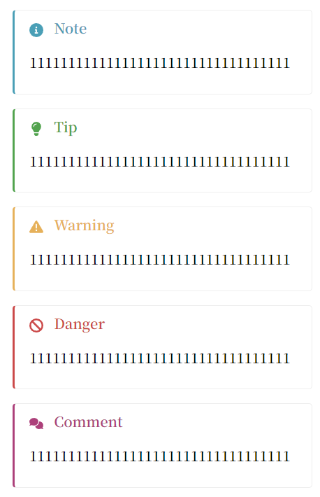
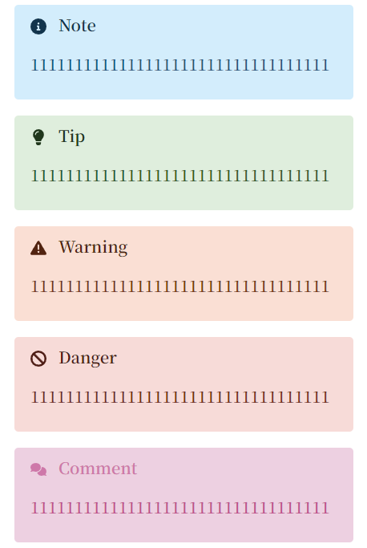

# What Is This ?

This is a project on pure web components merely using native `HTML`、`CSS` and `JavaScript` technologies.

It has features below:

* based on web components.
* frameworkless, can be used in native environment and any other web framework like `Vue`、`React`、`Angular` and so on.
* tiny and high performance.
* easy to use and beautiful user interface.

# How to Use

## Native Environment

* Step I: download file [`alerts.css`](components/Flexible-Alerts/alerts.css) and [`alerts.js`](components/Flexible-Alerts/alerts.js). On the one hand, you'd better make sure that `alerts.css`、`alerts.js` and your `example.html` are in the same directory. On the other hand, you can just let `alerts.css` and `alerts.js` are in the same directory but your `example.html` can be not --- you need handle these different path.

* Step II: import `alerts.js` at the end of your `example.html` which depends on these relationship of respective path.

* Step III: then you can use `wc-alerts` web components like this:

```HTML
    <wc-alerts type="note" label="note">
        <p slot="text">Lorem ipsum dolor sit amet consectetur adipisicing elit.</p>
    </wc-alerts>
```

Just take a look at this more specified example using `wc-alerts` web components:

```HTML
<!-- example.html -->
<!DOCTYPE html>
<html lang="en-US">

<head>
    <meta charset="UTF-8">
    <meta http-equiv="X-UA-Compatible" content="IE=edge">
    <meta name="viewport" content="width=device-width, initial-scale=1.0">
    <title>WC-Alerts</title>
</head>

<body>
    <wc-alerts type="note" label="note">
        <span slot="label">笔记</span>
        <p slot="text">Lorem ipsum dolor sit amet consectetur adipisicing elit. Libero, asperiores esse ipsam eveniet
            dolore eius nostrum ullam delectus modi sapiente? Itaque ea, corporis doloribus fugit nihil beatae
            distinctio perferendis odio vero at, omnis dolor! Praesentium nam similique eius provident, harum minus iure
            impedit atque fugit et ex reprehenderit facere a explicabo quam dolor sit qui quis error aliquid mollitia
            ea. Nisi consectetur nostrum, recusandae quaerat hic consequatur quibusdam dolorem amet quod culpa quae
            laudantium neque alias aliquam accusantium veniam quo qui, deleniti adipisci ab modi commodi sit
            perferendis. Ipsa quasi debitis non saepe iste doloribus eum? Asperiores est labore inventore.</p>
    </wc-alerts>

    <!-- default theme -->
    <wc-alerts type="note" label="note">
        <p slot="text">This is a note.</p>
    </wc-alerts>

    <wc-alerts type="tip" label="tip">
        <p slot="text"></p>
    </wc-alerts>

    <wc-alerts type="warning" label="warning">
        <p slot="text">1111111111111111111111111111111111</p>
    </wc-alerts>

    <wc-alerts type="danger" label="danger">
        <p slot="text">1111111111111111111111111111111111</p>
    </wc-alerts>

    <wc-alerts type="comment" label="comment">
        <p slot="text">1111111111111111111111111111111111</p>
    </wc-alerts>

    <!-- flat theme -->
    <wc-alerts type="note" label="note" theme="flat">
        <p slot="text">1111111111111111111111111111111111</p>
    </wc-alerts>

    <wc-alerts type="tip" label="tip" theme="flat">
        <p slot="text">1111111111111111111111111111111111</p>
    </wc-alerts>

    <wc-alerts type="warning" label="warning" theme="flat">
        <p slot="text">1111111111111111111111111111111111</p>
    </wc-alerts>

    <wc-alerts type="danger" label="danger" theme="flat">
        <p slot="text">1111111111111111111111111111111111</p>
    </wc-alerts>

    <wc-alerts type="comment" label="comment" theme="flat">
        <p slot="text">1111111111111111111111111111111111</p>
    </wc-alerts>

    <!-- import alerts.js -->
    <script type="module" src="./alerts.js"></script>
</body>

</html>
```

[Codepen Live Demo](https://codepen.io/paraoiawhy/pen/yLKrzpY)





## `Vue`

TODO

## `React`

TODO

## `Angular`

TODO

## `npm`

TODO